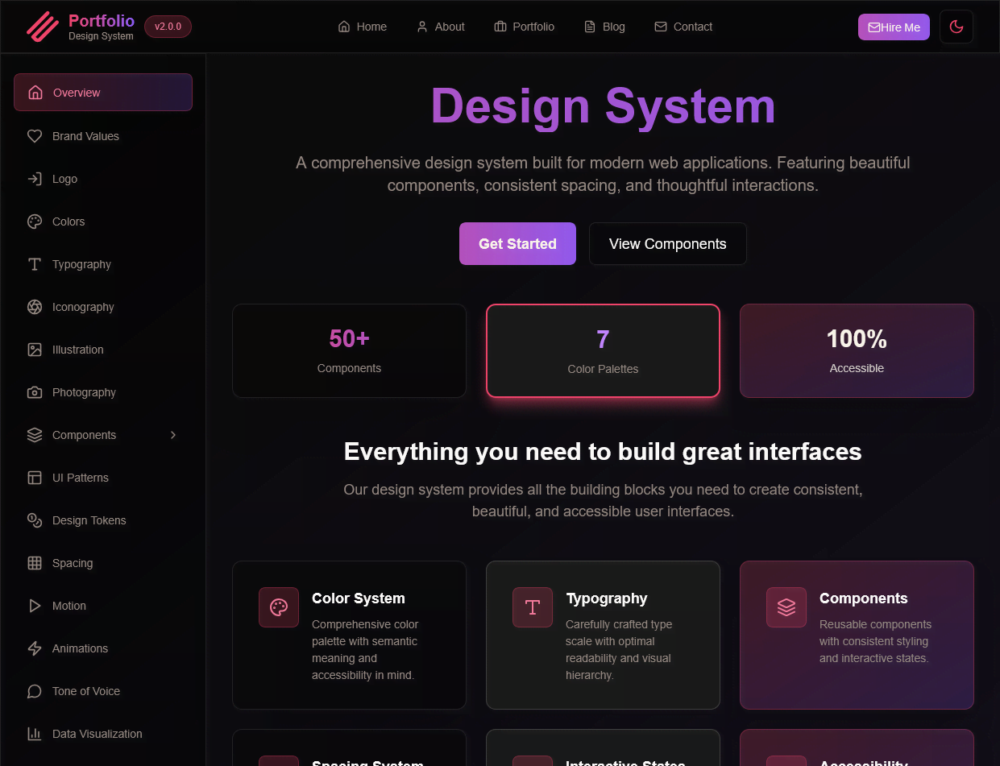
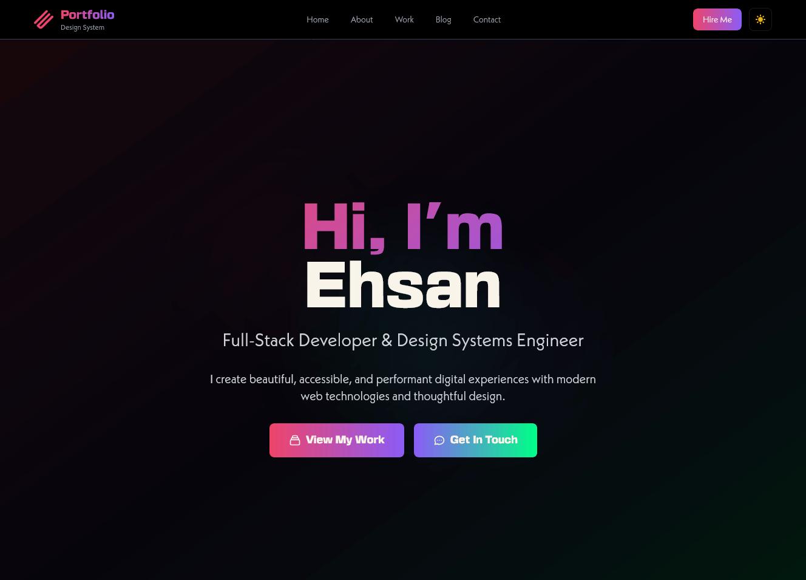

I have a confession: I’m obsessed with AI. 🤖 Specifically, I’ve been obsessed with seeing how far I can push **Bolt.new** and AI agents to build things for me while I just sip tea and watch the terminal scroll.

So, naturally, I decided to build a **complete, production-ready design system** from scratch. No manual tweaks, just me and my AI sidekick, building a modular world for my future projects.

The goal? A design system focused on _portfolios_. Not just buttons and inputs, but **Brand Values**, **Tone of Voice**, and **Accessibility**.

Spoiler alert: It was a beautiful disaster. 🌋

---

## 🛠️ The Dream: Building in Small Steps

I didn’t want the AI to just dump a thousand components on me. I wanted to be "the architect." We added stuff one by one.

- "Add a primary button."
- "Now, give me a hero section."
- "Wait, let's define the brand's 'voice' first."

It felt amazing. In just a few hours, I had [this comprehensive system](https://ehsanpo.github.io/design-system/). It had everything. A media player? Sure! A download center? Why not!

### The "Aha!" Moment

Adding extra components was _too_ easy. Need a complex data table? Boom, generated. This is where I got drunk on power. 🍺

---

## 🛑 The "Too Usefull" Mistake

The first lesson I learned: **AI loves a good over-engineer.** 🧠

Because it’s so fast to generate code, I let it add components that were way too complex. In the "real world," you don't need a media player with 40 different props just for a portfolio site. But the AI doesn't know that, it just wants to be helpful.

I ended up with a design system that was "too big." It was like trying to use a Swiss Army Knife that has 500 blades. Good luck finding the one you actually need!

---

## 📉 The Crash: When AI Met Reality

After patting myself on the back for my massive design system, I tried to actually _use_ it. I wanted to remake my own portfolio using these shiny new components.

**This is where the wheels fell off.** 🏎️💨

I pointed my AI agents at my portfolio data and said, "Okay, use the design system to build this."

1. **The Context Window Wall**: The system was so big that the AI agents struggled to keep the whole thing in "mind."
2. **Component Hallucinations**: Instead of using my `<Card />` component, the AI would get lazy and just make a new `div` with some Tailwind classes.
3. **The Token Burn**: I burned through a mountain of tokens just trying to convince the agent to stop changing the UI and follow the guides I literally just finished building.

I gave up. It was faster to write it by hand than to manage the AI manager. 🫠

---

## 🧩 Interactive: The Design Token Headache

One of the biggest hurdles was the transition to **Tailwind 4**. I had all these design tokens in TypeScript, but Tailwind 4 is moving heavily toward CSS variables.

Try it yourself! Toggle between the "Modern" (CSS-first) and "Legacy" (JS-first) approach below to see why my AI agent got so confused.

  

    <h4 style="margin: 0; color: #fff;">Token Strategy</h4>
    <button class="clip2" id="toggleBtn" style="background: #FFEE08; color: #000; border: none; padding: 5px 15px; border-radius: 6px; cursor: pointer; font-weight: bold;">Switch Mode</button>
  

  
  

    <pre id="codeSnippet">// Current Mode: Tailwind V3 (JS)</pre>
    

      Hello World
    

  

---

## 💡 The Pivot: A Better Way

I wish I had started the other way around. Instead of building a generic "Big Bang" design system, I should have:

1. Built a **black or unstyled portfolio** first.
2. Mapped out the **sitemap**.
3. Built components _as needed_ around that specific structure.

When you build the system in a vacuum, you end up with a lot of "theoretical" features that just confuse the AI agents later.

---

## 🌈 The Redemption: Astro + Wretched Wind

I took a break for a month. Cleared my head. Then, I tried again.

This time, I used **Astro**. I focused on building exactly what I needed. I still had to do some manual fixes (AI isn't 100% there yet for high-polish design), but it worked!

The result? [Wretched Wind](https://ehsanpo.github.io/wretched-wind/). 🌪️

It’s leaner, faster, and the design actually _fits_ together because it was built with a purpose, not just to see how many components an AI could generate.

### 📝 Lessons for my fellow AI tinkerers:

- **Small is fast.** Big design systems are AI magnets for confusion.
- **Sitemap first.** Know where you're going before you build the car.
- **Stay flexible.** Tailwind 4 is changing things, keep your tokens close to the CSS.

The AI is a great co-pilot, but don't let it fly the plane into a mountain of over-engineered components. Keep it simple, keep it purposeful. ✌️
