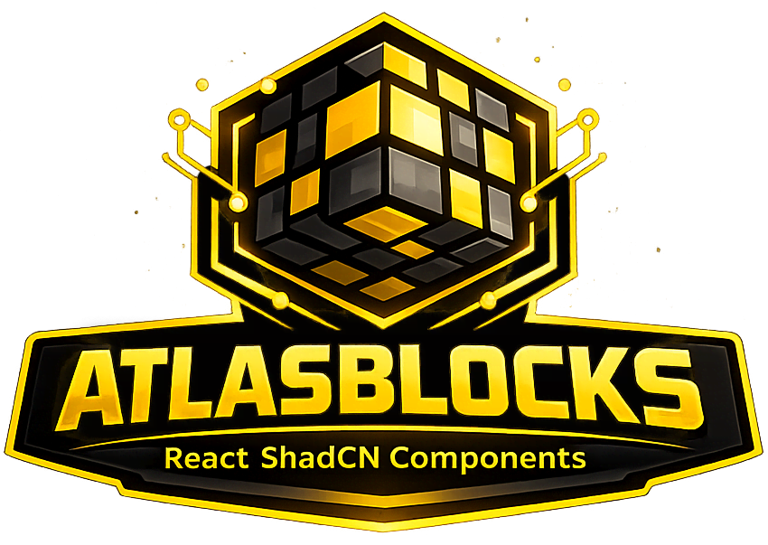

So... funny story. About 10 years ago, when I was working at **Guts & Glory**, I shipped WordPress sites like it was my full-time cardio routine. 🏃‍♂️ Every. Single. Day. Landing pages, basic content sites, you name it.

And here's the thing - every site was custom-made from scratch. Which sounds cool and artisanal until you've built your 5th "About Us" section in a week. Then it just feels... exhausting? Yeah, exhausting.

---

## 🤯 The Birth of Blockpress (aka "I'm So Done Starting From Scratch")

I got tired. Like, really tired. So I did what any lazy-but-smart developer would do: I made [Blockpress](/products/blockpress).

Blockpress was basically a collection of completely **unstyled content blocks** that I could reuse across projects. Built with ACF (Advanced Custom Fields) in WordPress, these blocks had some basic options to tweak how they looked in the backend. Nothing fancy, nothing UI-framework-y, just solid, reusable content structures.

I had this style guide from a designer - you know, margins, borders, button styles, all that good stuff - and I just... reused it. Over and over. **20+ sites.** All using the same blocks. All looking different because of the styling.

And honestly? They worked. Really well. 😌

---

## ⏰ Fast Forward 10 Years...

So here we are, **a decade later**, and I'm scrolling through some old GitHub repos (don't judge me, we all do it). I stumble upon Blockpress and I'm like... _wait, these still look good_. Like, genuinely good. The structure, the logic, the content patterns - they all held up.

And then I had a thought: **What if I ported these to React?**

But not just React. React with **Tailwind** and **Shadcn**. So I could install them with one command from my terminal, just like the old Blockpress days, but for modern React apps.

And that's how **AtlasBlocks** was born. 🎉

---

## 🛠️ What I Learned (aka "Web Dev Hasn't Changed That Much")

### 1. **The Stack Changed, The Patterns Didn't**

Here's the wild part: reading my 10-year-old PHP code and porting it to React was... **easy**. Like, shockingly easy.

Why? Because the concepts are the same:

- **ACF Custom Fields** → **React Props**
- **WordPress Loops** → **Array.map()**
- **Template Parts** → **React Components**

Web development hasn't fundamentally changed. We're still building content blocks, we're still passing data around, we're still styling things. The syntax is different, but the patterns? Nah, those are eternal. 🕰️

### 2. **Adding MCP Was Easier Than I Thought**

I wanted to modernize AtlasBlocks by adding **MCP (Model Context Protocol)** so people could use AI code agents to install and manage blocks. I had **no idea** how MCP worked going in.

But guess what? It took me like... **1-2 hours**.

I set up a couple of Vercel functions, gave it:

- 2 commands
- Info about each block
- A link to the GitHub React code

And boom. Done. ✅

Well, almost done...

### 3. **The Stupid Mistake That Wasted 30 Minutes**

Okay so... I got stuck for like half an hour because I was **posting to the wrong URL**. 🤦‍♂️

I was using an old deploy URL instead of the production URL from Vercel. I kept getting **401 and 404 errors** and I was convinced Vercel had some security issue or was blocking my content or something.

Turns out? I was just being dumb. Changed the URL, everything worked. Classic developer move. 😅

### 4. **Shadcn Theming Actually Makes Sense**

I've used design systems before, but I'd never really dug into how **Shadcn theming** worked. You know, the whole Tailwind CSS variable setup with classes like `.text-foreground` and `.bg-primary`.

At first I was like "this feels weird," but after working with it for a bit? It actually feels... **natural**. Like, it just _makes sense_. People can change themes and colors super easily, and the consistency is baked in.

10/10, would recommend. 👍

---

## 🎨 What's Inside AtlasBlocks?

Right now, AtlasBlocks has:

- **Content Blocks** - The original Blockpress classics (hero sections, feature grids, testimonials, etc.)
- **Modern Add-ons** - Parallax Swipe Carousel, fancy hero blocks, product features
- **Footers & Headers** - Because every site needs 'em
- **Shadcn + Tailwind Integration** - Install with one command, theme with CSS variables

It's built with:

- **React** ⚛️
- **Tailwind** 🎨
- **Vite** ⚡

And it's all available on **[GitHub](https://github.com/ehsanpo/atlasBlocks)** with a live demo at **[ehsanpo.github.io/atlasBlocks](https://ehsanpo.github.io/atlasBlocks/)**.

---

## 🤔 Why Did I Actually Make This?

Honestly? Because I **always** wanted to have "yet another Tailwind library in React."

Is the world drowning in component libraries? Yes.

Did I care? No. 😂

Also, this isn't really for UI-ish stuff. It's for **content**. The boring, bread-and-butter stuff that every website needs. Hero sections, testimonials, feature grids, pricing tables. You know, the stuff you Google "React hero section" for at 2 AM.

And I'm definitely gonna use it for new websites and product pages in the future. Plus, it's a nice playground to add more blocks later on.

---

## 🚀 Final Thoughts

Looking back, it's kinda wild that code I wrote **10 years ago** is still relevant today. Like, the web has evolved so much (RIP jQuery), but the fundamentals? Solid as ever.

AtlasBlocks is live, ready to use, and honestly? I'm pretty proud of it. If you're building content-heavy sites and want some solid, reusable blocks, check it out.

And if you spot any bugs or have ideas for new blocks, hit me up on GitHub. I'm always down to tinker. 🛠️

---

**Links:**

- **GitHub:** [github.com/ehsanpo/atlasBlocks](https://github.com/ehsanpo/atlasBlocks)
- **Live Demo:** [ehsanpo.github.io/atlasBlocks](https://ehsanpo.github.io/atlasBlocks/)

Now go build something cool. And maybe reuse some code while you're at it. 😎
