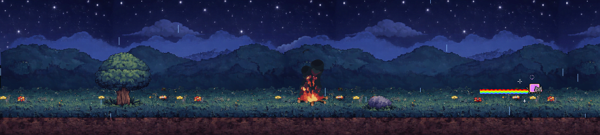

## The Day I Ate My Words (and loved every bite) 🤤

So there I was, scrolling through my usual tech feeds when I stumbled upon this article about how [Wails.io](https://wails.io/) is supposedly the "next Electron" - faster, smaller, better, yada yada yada...

My immediate reaction? 🙄 "Yeah sure, another framework claiming to be better than Electron lol"

I mean, come on! How many times have we heard this story? "Oh, we're gonna revolutionize desktop apps!" - meanwhile it's just another wrapper around a browser engine with fancy marketing.

My defense walls went UP immediately. In my head I was like: "No way they can do better than an embedded browser" and "This is probably just hype from some Go fanboys."

**And then I tried it...**

**\*F\*\*\*\*** HELL! IT WAS FAST! 🚀

Like, REALLY fast. Not "oh it's slightly better" fast - I'm talking about "holy crap why is this smoother than running in Firefox?!" fast.

I don't even care about the backend part at this point (spoiler: I barely use it lol). This was just an incredibly fast way to pack ANY web application into a native one!

Easy install ✅  
Good boilerplate for React + TypeScript ✅  
Actually works as advertised ✅

## The Frontend Rabbit Hole 🕳️

Recently I've been playing A LOT with animations on the web - not with a game engine, but mostly with pure JS and CSS. I saw some tutorials on how to make a top-down game using ONLY JavaScript and CSS, and honestly? I've been obsessed.

I even made a tiny easter egg on my website - added some pixel world thingy using spritesheet I found from itch.io. It's probably way too hidden but hey, that's what makes it fun! 😄


_My little pixel world easter egg - try finding it on my site!_

But here's where it gets interesting... I found out you can make sprite sheets with AI now! 🤖

BOOM! I tried a bunch of different prompts to get good working results, experimenting with Gemini and other AI tools. But here's the thing - I wanted to SEE the animations, not just imagine how they'd look.

And that's how this app was born! 💡

## The Idea: An App That Actually Makes Sense

I wanted something simple: an app where you can generate HTML & CSS and GIFs from a sprite sheet.

The workflow I imagined:

1. Select an image (your sprite sheet)
2. Configure your grid settings
3. Preview different animations from the same file
4. Export them into different CSS classes
5. Profit! (well, satisfaction at least 😅)

I added some other features while I was testing the AI-generated images from Gemini and figuring out the export process.

## The Build: Surprisingly Smooth!

Here's the crazy part - I literally copied the frontend React components from one of my other projects, dropped them into the Wails frontend, and BOOM!

Just needed to do some cleanup and figure out how to build it on GitHub Actions. That's it!

**Timeline breakdown:**

- Frontend: ~1 day
- Backend: ~0.5 day (and I'm not even using it much! 😂)

The app has some pretty neat features:

### Core Features I Built:

- **Image upload & grid detection** - automatically figures out dimensions
- **Advanced animation config** - adjustable columns/rows, margins, manual positioning
- **Multi-animation support** - handle multiple animations in one sprite sheet
- **Real-time preview** - see your animations as you configure them
- **Export madness** - CSS, HTML, ZIP files, even high-quality GIFs!
- **Project management** - auto-save, import/export settings


_The main interface - clean and functional_

  
_Real-time preview window with export options_


_Generated CSS and HTML - ready to copy-paste!_

## The Surprise: Better Than Browser Performance! 😱

And here's the kicker - to my surprise, it actually runs BETTER in Wails than in Firefox!

Less memory usage = faster and snappier app. I was NOT expecting that. Like, at all.

The whole thing just felt more responsive, more native. It's like having a web app that doesn't feel like a web app, you know?

I don't use the backend functions at all right now (everything happens in the frontend), but maybe I'll move the ZIP creation and GIF generation to the Go backend later to make it even faster and more stable. But honestly? This works SO good already.

## What's Next? (Spoiler: AI Integration!) 🤖

Take the app to the next stage? Maybe!

What's next on my mind: integrate the image generation API directly into the app so you can generate AND animate in the same place. One-stop-shop for sprite creation and animation.

But right now I don't really want to set up payment systems for a side project (this is just for fun!), and those API calls are NOT cheap! 😅

For now, I'm super happy using this app to generate sprite sheets with CSS. Here are some examples I've been playing with:

### 🔥 **Fire Animation** - Perfect for game UI elements

Check out this fire animation I generated with the tool! This is exactly the kind of stuff that gets me excited about sprite animations:

<div style="background: #111; padding: 2rem; border-radius: 8px; text-align: center; margin: 1rem 0;">
  <div class="fire-demo" style="
    width: 192px; 
    height: 172px; 
    background-image: url('/img/px/fire/fire_spritesheet.png');
    background-repeat: no-repeat;
    display: inline-block;
    animation: fire-animation 0.70s steps(7) infinite;
  "></div>
  <p style="color: #888; font-size: 0.75rem; margin-top: 1rem;">Live fire animation - smooth CSS keyframes!</p>
</div>

<style>
@keyframes fire-animation {
  from { background-position: 0px 0px; }
  to { background-position: -1344px 0px; }
}
</style>

_Generated with Animator - perfect loop, clean code!_

The CSS generated is super clean too:

```css
.sprite-row-1 {
	width: 192px;
	height: 172px;
	animation: play-row-1 0.7s steps(7) infinite;
}

@keyframes play-row-1 {
	from {
		background-position: 0px 0px;
	}
	to {
		background-position: -1344px 0px;
	}
}
```

🏃 **Character Walking** - Classic 8-bit style movement  
⚔️ **Attack Sequences** - Combat animations for indie games

_(More examples coming soon! I'm having too much fun with this tool! 😂)_

## Tech Stack & Lessons Learned

**Frontend:**

- React 18 + TypeScript (because 2025 and we're not animals)
- Vite for blazing fast development
- Tailwind CSS (my beloved ❤️)
- Lucide React for icons
- gif.js, jszip, file-saver for the heavy lifting

**Backend:**

- Go with Wails framework
- Cross-platform builds (Windows, macOS, Linux)

**Key takeaways:**

1. **Don't judge a framework by its hype** - sometimes the hype is actually justified
2. **Wails is genuinely fast** - faster than I expected, faster than browser
3. **Go + React is a killer combo** - simple backend, powerful frontend
4. **Small bundle sizes matter** - no Electron bloat here
5. **Native integration is smooth** - access to OS features without the pain

## Wrapping Up: From Skeptic to Fan

Look, I was wrong. Really wrong.

Wails isn't just "another Electron alternative" - it's actually a legitimate solution for building fast, native desktop apps with web technologies.

The development experience was smooth, the performance is impressive, and the result feels genuinely native. Plus, the community and documentation are solid.

If you're building a desktop app and considering Electron, do yourself a favor and at least TRY Wails first. You might be as pleasantly surprised as I was.

And hey, if you want to check out the Animator app, it's open source! Feel free to poke around the code, suggest improvements, or just use it to make some cool animations.

**GitHub Repo:** [ehsanpo/Animator](https://github.com/ehsanpo/Animator)

Now if you'll excuse me, I have some more AI-generated sprite sheets to animate... 🎮
