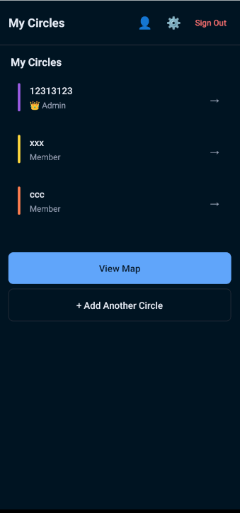
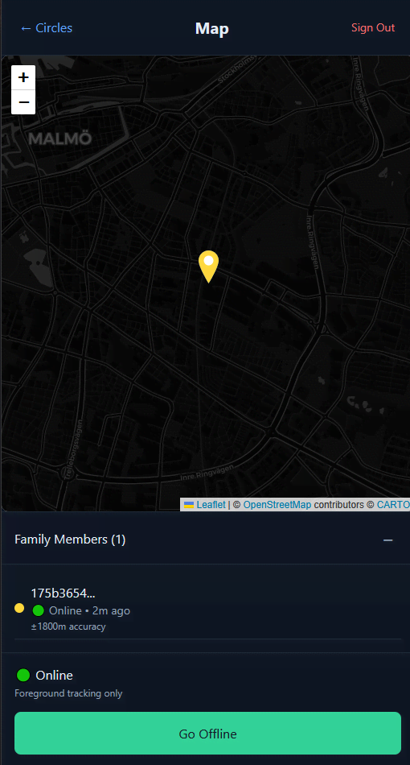

So here's how this whole thing started...

My wife comes up to me last week and goes "Hey, can you find us a tracking app? I want to know when the kids are on their way home from school."

Simple request, right? WRONG! 😅

I spent like 2 hours researching family tracking apps and OH MY GOD what a nightmare! Every single one of them is either:

1. **Creepy surveillance software** that tracks EVERYTHING (like, do I really need to know my kid's battery percentage and how fast they're walking??)
2. **Privacy black holes** with terms of service longer than my mortgage contract
3. **Feature-bloated monsters** that need a PhD to figure out how to just see where someone is

And don't even get me started on the data collection! These apps know more about your family than your own grandmother does. No thank you! 🙅‍♂️

So naturally, my brain did that thing where instead of just picking the "least bad" option, I thought: "How hard could it be to build my own?"

_Narrator: It was harder than he thought_ 😂

---

## The "Oh Crap" Moment

Look, I've been doing React Native with Expo for a few years now, so I wasn't completely insane thinking I could pull this off. Expo is honestly THE way to build React Native apps - no more fighting with native builds or spending 3 hours trying to figure out why iOS is being weird (again).

But here's the thing... I haven't actually tested this with real kids yet 👶

Like, I built the whole app, it works perfectly on my phone and my wife's phone, but will it actually work when our 10-year-old is running around school with terrible WiFi and 15% battery?

_Insert nervous laughter here_ 😬

That's a problem for future Ehsan! Right now, let me tell you about the absolute rollercoaster of building this thing...

---

## Why I Went Full "Privacy Paranoid Parent" Mode

Okay, so after looking at all these tracking apps, I realized they're basically just data harvesting machines disguised as family safety tools. They want to know:

- Where you go (obviously)
- How often you go there
- How long you stay
- Who else is there
- What your driving habits are like
- Your daily routines
- And probably what you had for breakfast! 🥓

Meanwhile, my wife and I literally just want to know: "Are the kids walking home or are they still at school?" That's it! We don't need a full FBI surveillance package!

So I decided to build something that's actually privacy-first. Like, for real this time. Not "we care about your privacy (but also we're selling your data to 47 companies)" privacy.

Here's my privacy rules:

- **Only collect what we actually need** - GPS coordinates and timestamps, that's it
- **Delete old data automatically** - Location history older than 30 days? GONE! 🗑️
- **User controls everything** - Want to stop sharing? One tap and you're invisible
- **No tracking by default** - You have to actively join a family circle

It's like the opposite of every other app out there!

---

## The "Circles" Idea (Because Families Are Complicated)

Instead of just "add family members," I came up with this thing called "Circles." Think of it like group chats but for location sharing.

Here's how it works:

- Someone (usually the paranoid parent, aka me) creates a Circle
- You get a silly join code like "PIZZA42" or "BANANA99"
- Family members enter the code to request access
- Circle admin approves them
- Boom! Everyone can see everyone else on a map

Why circles instead of just "family"? Well, our extended family situation is... let's call it "dynamic" 😅

Sometimes we want to share location with grandparents. Sometimes it's just immediate family. Sometimes it's the whole cousin crew when we're planning a BBQ. Circles let you have different groups without the family drama!

Plus each circle gets its own color on the map. So your "School Pickup" circle shows up as blue dots, your "Weekend Plans" circle is green, etc. Visual organization for the win! 🎨

<div class="flex gap-2">






</div>

---

## Expo + Supabase: The Dream Team I Didn't Know I Needed

I've been team Expo for years now. Like, why would you ever want to deal with native iOS/Android builds when Expo just... works?

And it runs on web too! So when my wife wants to check where the kids are from her laptop, she doesn't need to install anything. Just open a browser tab. _Chef's kiss_ 👌

For the backend, I almost went with Firebase (because, you know, Google and all that), but Supabase won me over:

- **Real PostgreSQL** - Actual SQL! Not some weird NoSQL syntax I have to Google every single time
- **Built-in real-time** - WebSocket magic for live location updates
- **Row Level Security** - Privacy controls built into the database itself
- **Actually good documentation** - Revolutionary concept, I know! 📚

---

## Real-Time Location Updates: AKA "How to Make Your Phone Hate You"

Okay, this is where things got... interesting.

Getting real-time location updates is like trying to juggle while riding a unicycle. So many things can (and will) go wrong:

**Android permissions are a nightmare:**

- "Allow location access?"
- "Allow background location access?"
- "Allow precise location?"
- "Allow location when app is closed?"
- "Are you sure you're sure?"

It's like Android actively doesn't want apps to know where you are. Which is good for privacy, terrible for family tracking! 😤

**Battery optimization will destroy you:**
Every phone manufacturer has their own special way of killing background apps. Samsung? Especially aggressive. Xiaomi? Good luck keeping anything running in the background!

**Network issues everywhere:**
What happens when someone's phone is on airplane mode? Or they're in a dead zone? Or their data plan ran out? (Looking at you, teenage son who streams TikTok all day...)

My solution? Keep it simple and don't fight the system:

```javascript
const trackLocation = async () => {
	// Get permission first (pray they say yes)
	const { status } = await Location.requestForegroundPermissionsAsync();

	if (status === "granted") {
		// Update every 30 seconds when app is open
		Location.watchPositionAsync(
			{
				accuracy: Location.Accuracy.Balanced, // Good enough!
				timeInterval: 30000,
				distanceInterval: 100, // Only if you moved 100 meters
			},
			(location) => {
				sendLocationToSupabase(location);
			}
		);
	}
};
```

The trick is being smart about when to actually update. If dad is sitting on the couch for 2 hours watching Netflix, we don't need 240 identical location pings! 📺

---

## Database Design: Overthinking Level 9000

I spent WAY too much time making this database schema perfect. Like, I had foreign keys everywhere, junction tables, normalized to death...

Then I realized: Ehsan, this is a family tracking app, not the next Facebook! 🤦‍♂️

Final schema is beautifully simple:

- **circles** - Basic info + those silly join codes
- **circle_members** - Who's in what circle (with approval status)
- **locations** - GPS coordinates + timestamps + user info

That's it! Three tables!

The real magic happens with Supabase's Row Level Security. Instead of checking "can this user see this location?" in my app code, I just tell the database: "Only show locations to people who are in the same circle."

Someone tries to hack the API? Database goes "nah fam" and returns nothing. Beautiful! 🛡️

---

## Background Tracking: The Boss Fight

This was honestly the hardest part. Getting location updates when the app isn't actively open is like trying to teach a cat to fetch.

Android has become super paranoid about background apps (rightfully so), but it makes family tracking... challenging.

My approach:

1. **Foreground tracking** - Works great when app is open
2. **Background tasks** - For maybe 10-15 minutes when app gets minimized
3. **Last known location** - Save locally, sync when app reopens
4. **Manual check-ins** - Because sometimes simple is better!

Is it perfect? Nope! But it's good enough for "where are the kids right now" without turning their phones into portable space heaters 🔥

I also added a toggle to completely disable background tracking. Some people just want to check in manually when they arrive places. And that's totally fine!

---

## The Privacy-First Philosophy (No Really, I Mean It)

This is honestly what I'm most proud of. Every single decision was made with privacy in mind:

**Data minimization is king:**

- Only store what we absolutely need
- No analytics, no crash reporting, no "user experience improvement"
- Your location data is YOUR location data

**Automatic cleanup:**

- Location history older than 30 days? Automatically deleted!
- App keeps current location + last known location, that's it
- No "but what if you want to see where you went 6 months ago?" - NOPE!

**User control everything:**

- Want to leave a circle? One tap, you're gone
- Want to stop sharing location? Toggle it off instantly
- Want to delete all your data? There's a big red button for that!

**No tracking by default:**

- App literally can't see your location unless you actively join a circle
- Even then, only people in YOUR specific circles can see you
- No "oops we were tracking everyone accidentally" nonsense

I'm even thinking of adding an "invisible mode" where you can see others but they can't see you. For those times when you need to be... strategically unavailable 😏

---

## Web Version: The Accidental MVP

Originally, I built the web version just for testing. Didn't want to keep deploying to my phone every time I changed something.

But it turned out to be super useful! Think about it:

- At work and want to check where everyone is? Open a browser tab
- Need to approve someone joining a circle? Easier on a big screen
- Older family members prefer using computers sometimes

My dad actually uses the web version more than the mobile app! He bookmarked it and everything. Technology wins! 💻

The web version can't do background tracking (browser limitations), but it's perfect for:

- Quick location checks
- Admin stuff (creating circles, approving members)
- Testing without draining your phone battery

---

## What I Learned (The Hard Way)

**Location permissions are user experience hell:**
I probably spent more time on the permission flow than the actual tracking. Android makes you ask for like 6 different location permissions, and if users say no to any of them, your app becomes useless.

**Real-time is really hard:**
WebSockets, reconnection logic, offline handling, syncing when you come back online... There's a reason why companies have entire teams dedicated to this stuff!

**Battery life is everything:**
Cool features mean nothing if they kill your phone by lunchtime. I learned to be very careful about how often I ask for location updates.

**Test on actual crappy phones:**
The simulator lies about EVERYTHING location-related. That fancy iPhone 15 Pro in the simulator? Not representative of your kid's hand-me-down Android with 47% battery and spotty connection.

**Privacy by design is hard but worth it:**
It's so much easier to just collect everything and figure out privacy later. But building it in from the start means you never have to have those awkward "we accidentally stored everyone's data for 10 years" conversations.

---

## What's Next? (Feature Creep Incoming!)

Oh boy, do I have ideas:

- **iOS support** - Obviously! Just need to figure out Apple's developer program (and pay the $99/year toll 💸)
- **Smart notifications** - "Kid arrived at school" or "Everyone's home safe"
- **Geofences** - Alert when someone leaves a specific area
- **Better offline handling** - Queue up location updates when connection is spotty
- **Location history** - Maybe a simple timeline view?

But honestly? Right now it does exactly what my wife asked for. Kids can share their location when walking home from school. We can see where everyone is on a simple map. Mission accomplished! 🎯

Sometimes the best solution is the simplest one.

---

## Why I'm Sharing This (And You Should Build Stuff Too!)

I could have just used Life360 or Find My Friends and called it a day. But where's the fun in that? 🤪

Building your own solution means:

- **You control the privacy** - No mysterious data collection
- **You learn tons** - Real-time apps, location services, database design
- **You can customize everything** - Want purple circles? Done!
- **It's actually fun** - Even when it's frustrating

The code is up on [GitHub](https://github.com/ehsanpo/tracking-app) if you want to check it out. Fair warning: it's very much a work-in-progress and probably has bugs I haven't discovered yet!

But that's okay! Perfect is the enemy of shipped, as they say.

Now if you'll excuse me, I need to go convince my kids to actually test this thing... Wish me luck! 🤞
