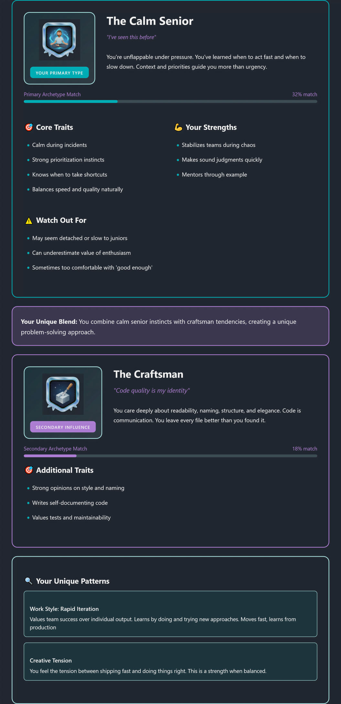

So… I built a thing.
It's called **Developer Type Assessment** and it tells you _what kind of developer brain you have_ 🧠💻

Not "are you good at algorithms" (pls no), but more like:

- do you **ship fast** or **overthink everything**
- do you love **clean code** or just want it to _work_
- do you debug like a detective or YOLO your way through bugs

👉 You can try it here:
[https://ehsanpo.github.io/developertype/](https://ehsanpo.github.io/developertype/)

I honestly started this as a "fun weekend project" and then suddenly I was deep into psychology, scoring algorithms, and arguing with myself about color contrast at midnight. Classic.

---

## The Idea (aka: what was I thinking?)

I didn't want a skills test.
No quizzes like _"what does this JavaScript output?"_ (trauma 😭).

I wanted something more **psychological**.
Something that feels like real dev life.

Every question forces a trade-off:

- ship fast vs build it right
- explore vs maintain
- solo grinding vs team collaboration

Your answers slowly pull you toward one of **12 developer archetypes** like:

- **The Ship It** 🚀
- **The Detective** 🕵️
- **The Craftsman** 🛠️
- (yes, Architecture Astronaut is there too 👀)

No "right" answers. Just vibes.

## 💡 Inspiration

This assessment was inspired by the article [The 12 Developer Mindsets I've Seen in My Career](https://dev.to/notadevbuthere/the-12-developer-mindsets-ive-seen-in-my-career-and-what-they-teach-us-about-building-software-42de) by [@notadevbuthere](https://dev.to/notadevbuthere). The archetypes and core concepts are based on real developer behaviors and patterns observed in software teams.

---

## The Stack (kept it simple, promise)

I didn't want backend drama. No auth. No DB. No servers.
Just frontend fun.

- **React + Vite** – fast, clean, no pain
- **React Router** – with `HashRouter` because GitHub Pages 😅
- **Pure CSS** – no Tailwind, no frameworks, just vibes and CSS variables
- **html2canvas** – for downloading results as images (this was surprisingly fun)

That's it. No magic. No enterprise nonsense.

---

## Cool Stuff I'm Proud Of ✨

### 🧠 Smart-ish Scoring

Each answer gives **weighted points** to multiple archetypes.

So you're not just "one thing".
The algorithm can notice stuff like:

> "huh, this person scores high in _Ship It_ AND _Craftsman_… interesting tension 👀"

It actually felt like teaching the app to understand personalities. Kinda creepy. Kinda cool.

---

### 🔗 Shareable Results & Download

Results are encoded into the URL using base64.
No backend needed – just pure frontend magic ✨

Which means:

- share the link and anyone can see your result
- no retaking the test
- no database, no servers, my wallet is happy
- download your result as a PNG
- share directly to LinkedIn (yes, devs love this stuff)

Encoding state into the URL turned out to be insanely powerful. Sharing just works™ and I wanted it to feel like an **achievement unlock** 🎖️, not just text on a screen.

---

## The Questions (harder than coding tbh)

20 questions.
4 answers each.

This part took the longest.

Each answer had to:

- feel _real_
- map clearly to personality traits
- not scream "THIS IS THE CORRECT ANSWER" 🙃

Example question:

> **You find a messy file that somehow works. What do you do?**

- Rewrite it from scratch (perfectionist)
- Ship features and move on (pragmatic)
- Understand why it works first (detective)
- Refactor slowly over time (balanced dev)

If you read that and felt _personally attacked_… good 😈

---

## Things I Learned (aka: bugs taught me stuff)

### 🔑 React keys REALLY matter

I had a weird bug where answers from one question leaked into another.

Turns out:

```js
key={answer.id}
```

was NOT enough.

Fix:

```js
key={`${question.id}-${answer.id}`}
```

React stopped gaslighting me immediately.

---

### ⏱️ Tiny delays = better UX

That 300ms pause after clicking an answer?

Remove it and the app feels broken.
Add it and suddenly everything feels intentional.

UX is wild.

---

## Stats (because devs love numbers)

- 20 questions
- 12 archetypes
- ~5 minutes
- 0 backend servers
- Hosted on GitHub Pages
- Built in 2 hours

---

## Try It 👇

👉 **Take the test:**
[https://ehsanpo.github.io/developertype/](https://ehsanpo.github.io/developertype/)

👉 **Open source on GitHub:**
[https://github.com/ehsanpo/developertype](https://github.com/ehsanpo/developertype)

If you try it, tell me what type you got 👀
And if you read this far… wow. You're definitely not "The Ship It" 😅

Built for fun. Learned a ton.
Highly recommend building weird little projects like this.

Now excuse me while I add _one more feature_ that I definitely don't need. 🚀


