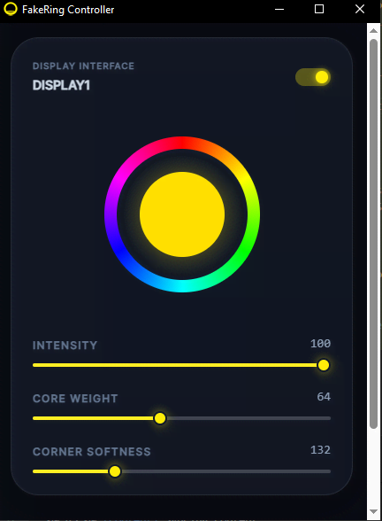
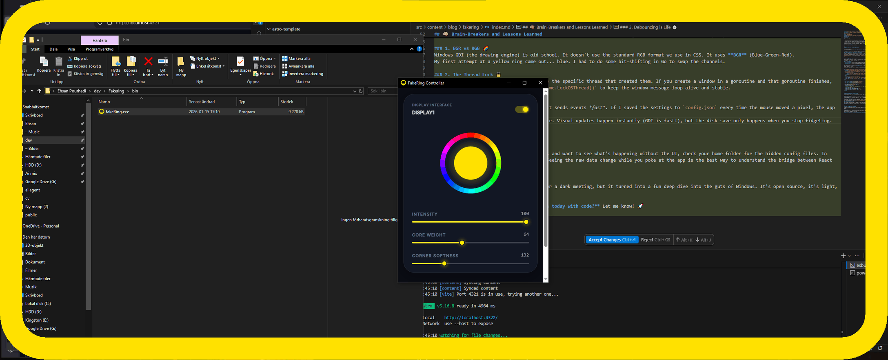

I have a problem: My room is dark, and my webcam is... well, temperamental. 💡

A few days ago, I was hopping into a meeting and my webcam decided it didn't want to adjust its brightness. I looked like a silhouette in a witness protection program. I didn't have any lamps nearby, so in a moment of desperation, I opened a blank Chrome tab with `about:blank`.

Suddenly, my face was illuminated. It worked. _Wait_, I thought, _why don't I just make this a real thing?_

And that's how **FakeRing** was born.

---

## 🏗️ The Tech Stack: Go meets the Desktop

I’ve been playing around with **Go** and **Wails v3** recently. If you haven't tried Wails, it’s like Electron but with a Go backend—way lighter and surprisingly powerful.

I used my own [create-wails-app](https://github.com/ehsanpo/create-wails-app) to get started, and then I went to battle with the Windows API.

### 1. Monitor Detection (The "Where am I?" problem)

To make a ring light for _every_ monitor, I first had to find out how many monitors the user actually has.

Wails handles the UI beautifully, but for the deep OS-level stuff, I had to talk directly to `user32.dll` using Go's `syscall` package. We use `EnumDisplayMonitors` to catch every screen and `GetMonitorInfoW` to get the exact coordinates of the "Work Area" (so we don't cover the taskbar).

---

## 🎨 "The Magic Ring": How it works

The goal was to draw a ring _on top_ of everything else, but it shouldn't block your clicks. Imagine having a ring light that prevents you from clicking the "Mute" button. Pure chaos. 🤡

### The Secret Recipe:

1. **WS_EX_LAYERED**: This lets us use transparency and alpha blending.
2. **WS_EX_TRANSPARENT**: This is the magic flag. It makes the window "click-through." The mouse events just pass right through to the apps behind it.
3. **Colorkeying**: I fill the window background with Magenta (`0xFF00FF`) and then tell Windows: "Hey, make this specific color 100% invisible."

### 🧩 Interactive: Visualize the Ring Geometry

The ring isn't just a border; it's a **subtraction**. We take a "Large Rect" (the screen) and subtract a "Smaller Rect" ( the inside) to create a perfect "Donut" or "Frame."

Try adjusting the slider below to see how the subtraction creates the ring.

  

    

        

    

    
Monitor Preview

  

  
  

    <label style="color: #fff; font-size: 12px; margin-bottom: 5px; display: block;">Ring Width: 20px</label>
    <input type="range" id="widthSlider" min="2" max="60" value="20" style="width: 100%; cursor: pointer;">
  

---

## 🧠 Brain-Breakers and Lessons Learned

Building desktop apps isn't all sunshine and rainbows. Here are three things that almost made me throw my keyboard:

### 1. BGR vs RGB 🌈

Windows GDI (the drawing engine) is old school. It doesn't use the standard RGB format we use in CSS. It uses **BGR** (Blue-Green-Red).
My first attempt at a yellow ring came out... blue. I had to do some bit-shifting in Go to swap the channels.

### 2. The Thread Lock 🔒

Win32 windows are "needy." They are tied to the specific thread that created them. If you create a window in a goroutine and that goroutine finishes, your window disappears. I had to use `runtime.LockOSThread()` to keep the window message loop alive and stable.

### 3. Debouncing is Life ⏱️

When you move the color slider in the UI, it sends events _fast_. If I saved the settings to `config.json` every time the mouse moved a pixel, the app would lag like crazy.
**Pro Move**: I implemented a 500ms debounce. Visual updates happen instantly (GDI is fast!), but the disk save only happens when you stop fidgeting.

---

## 🎓 The "Pro Move" for Debugging

If you're ever building something like this and want to see what's happening without the UI, check your home folder for the hidden config files. In FakeRing, it’s `~/.fakeRing/config.json`. Seeing the raw data change while you poke at the app is the best way to understand the bridge between React and Go.

### Wrap Up

FakeRing started as a "desperation tool" for a dark meeting, but it turned into a fun deep dive into the guts of Windows. It’s open source, it’s light, and it saves me from buying a $10 lamp.

**What weird problem are you going to solve today with code?** Let me know! 🚀
