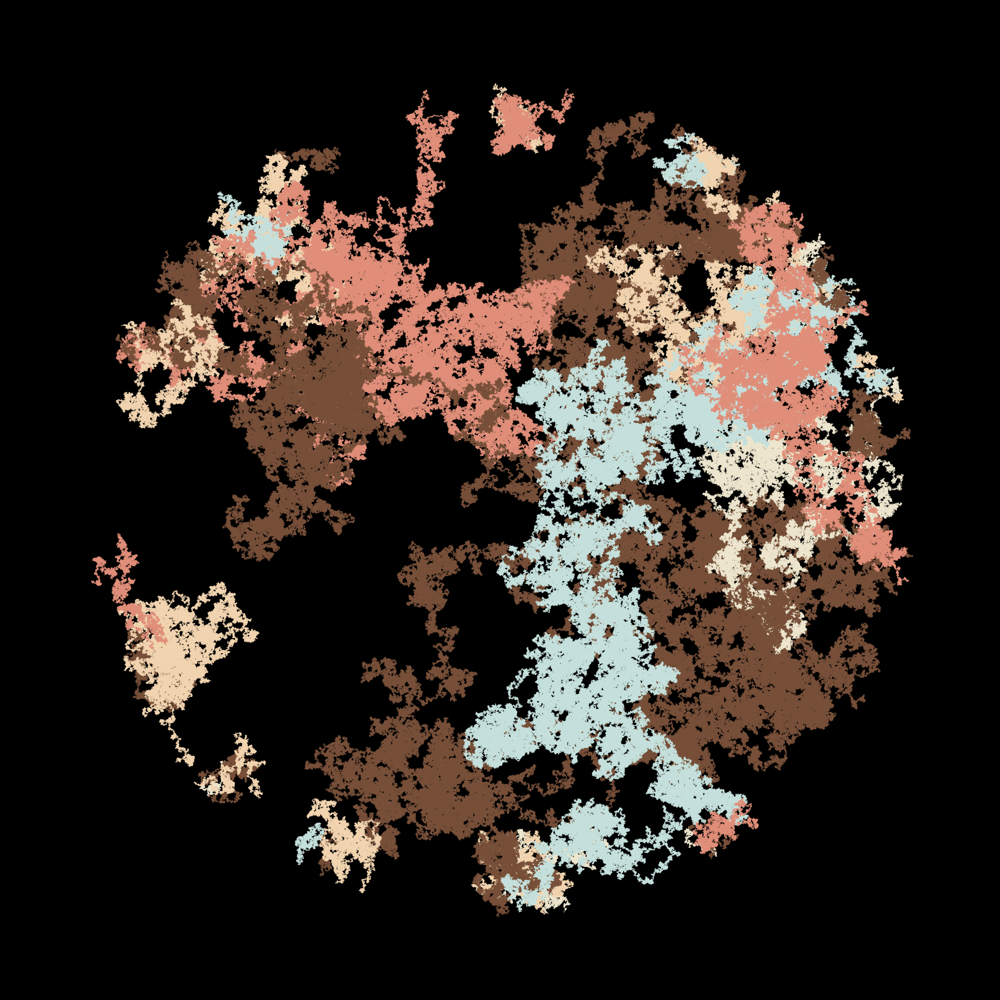
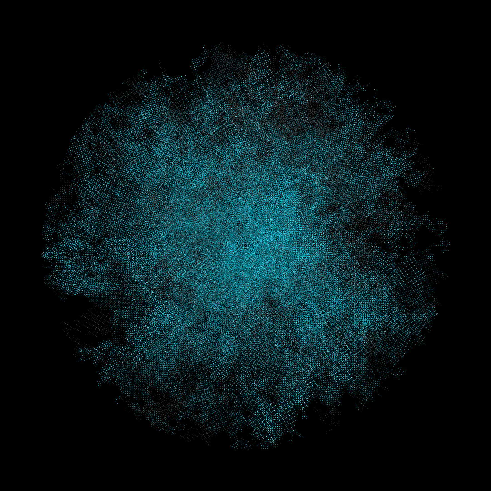
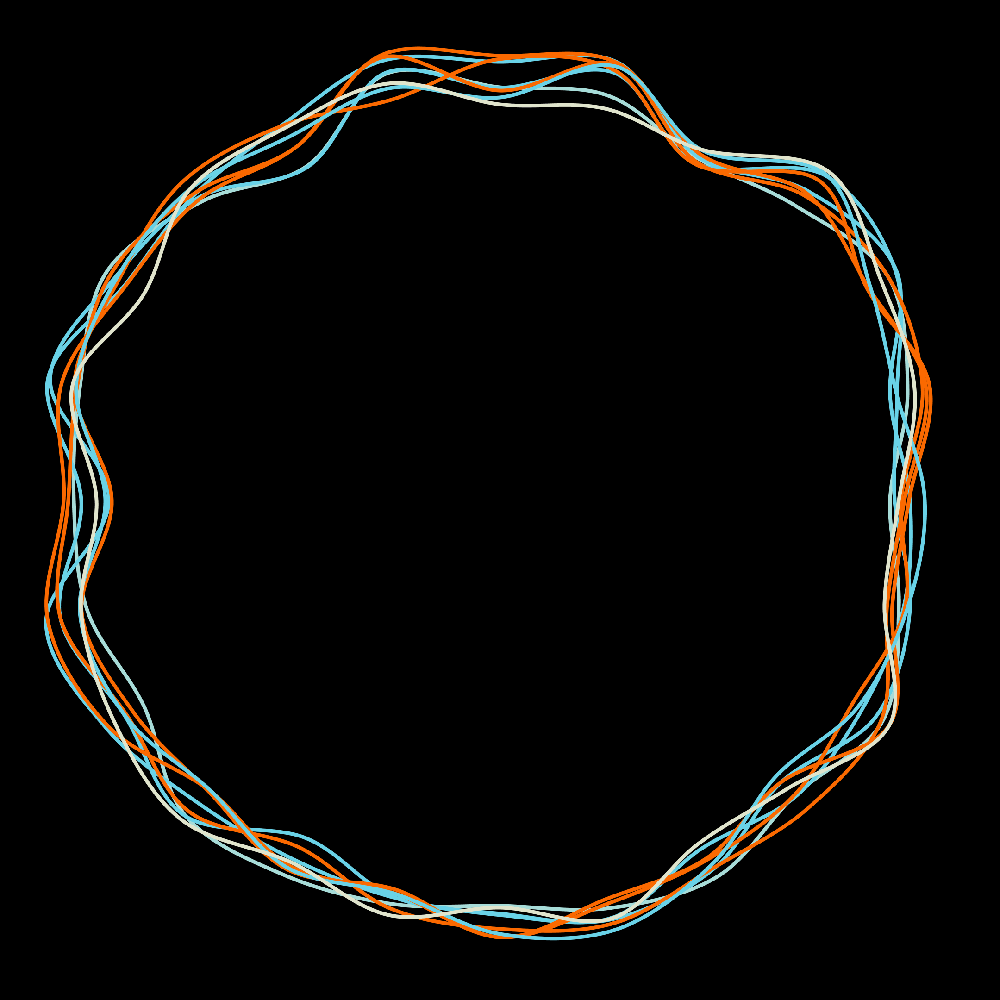
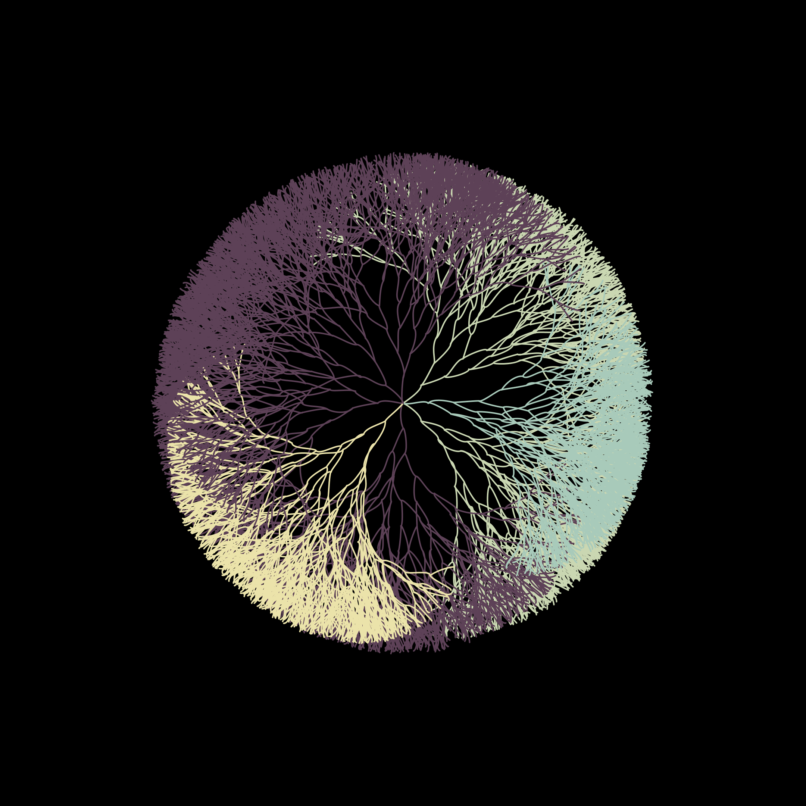

Okay so, recently I’ve been messing around with **generative music** in Propellerhead Reason (mostly as a form of procrastination, let’s be honest 😅). It started as a “let’s just see what happens” experiment and turned into a surprisingly fun rabbit hole.

You can actually hear one of my chaotic little audio creatures here:

<iframe width="100%" height="166" scrolling="no" frameborder="no" allow="autoplay" src="https://w.soundcloud.com/player/?url=https%3A//api.soundcloud.com/tracks/1172751727&color=%23ff5500&auto_play=false&hide_related=true&show_comments=false&show_user=true&show_reposts=false&show_teaser=false"></iframe>

_(yes, that’s one of my generative music tests😬)_

---

## From Music to Visuals 🎶➡️🎨

After spending way too many nights tweaking synth patches, I started thinking… what if I did the same thing visually? Like, **generative art** but for my eyeballs instead of my ears.

So I did what any normal person would do: opened ten browser tabs, fell into a GitHub hole, and discovered people making wild generative visuals in **R**, **Go**, and **Python**.

And wow. The stuff people do with just a few lines of code is _ridiculous_.

---

## Setting Things Up (a.k.a. The Java Saga)

Naturally, I decided to try it myself. Installed **R**. Then installed **Processing 3** on my Mac.
And… yeah, that was a disaster. 🙃

Processing 3 and Java apparently have beef, because nothing worked. After a few hours of debugging (and a small existential crisis), I rolled back to **Processing v2** and hallelujah! it worked.

Circles appeared! Pretty ones!

Honestly, at that point, I didn’t even care _how_ it worked. I just wanted to make cool visuals and pretend I was an algorithmic artist.

---

## The Results (woohoo! 🎉)

Here’s a few of the patterns I made:

_Complex overlapping circles that look like they’re plotting something_

_Minimalist and chill_

_Geometric perfection vibes_

_Kinda flowy, kinda alive_

_Dense and slightly overwhelming (like my brain on coffee)_

_Sunburst-y and dramatic_

_Like circles inside circles inside circles..._

_Looks like it might start spinning if I stare too long_

---

## What I Learned (aka why circles are secretly deep)

### 💡 The Beauty of Algorithms

Even though it was all circles, every image turned out _so different_.
Like:

- **Precise math** vs. **random chaos**
- **Dense complexity** vs. **clean minimalism**
- **Overlapping madness** vs. **perfect geometry**

It’s wild how much personality a few lines of code can have.

---

### 🧠 Processing vs. R

So I played around with both:

- **Processing** → felt way more natural for visuals. You draw, you tweak, you see results instantly.
- **R** → more technical but sooo good if you want mathematical control.
- Both communities are super active and helpful (thank you, random forum strangers 🙏).

---

### 🎨 Creativity Through Constraints

Here’s the funny thing, when I limited myself to **just circles**, I got _way_ more creative. Like, weirdly so.

By only tweaking stuff like:

- size
- opacity
- color gradients
- how they overlap or intersect
- little position algorithms

…I ended up with endless variations. Turns out “less is more” actually works sometimes (who knew?).

---

## My Tech Setup (for the curious nerds 👩‍💻)

**What worked:**

- Processing 2 (don’t ask me about v3 😩)
- Basic geometry functions
- Simple random() stuff
- Layer blending (chef’s kiss)

**My super scientific process:**

1. Draw a circle.
2. Randomize everything.
3. Go “hmm, interesting.”
4. Add color + opacity.
5. Layer it a bunch until it looks artsy.
6. Screenshot it before it breaks.

---

## Why I Love Generative Art 💖

It’s that **element of surprise**. You give the computer rules, and it goes, “cool, but what if I did this instead?”

You’re not _making_ the art, you’re _collaborating_ with the algorithm. It’s half you, half the machine, and 100% unexpected.

Every image feels both planned and chaotic at the same time. Like art with a mind of its own.

---

So yeah, what started as a music experiment turned into me falling in love with algorithmic circles.

Who needs perfection when you have randomness, right? 😉

_(P.S. If you’ve made generative art, please share! I love seeing what other curious nerds create ❤️)_
