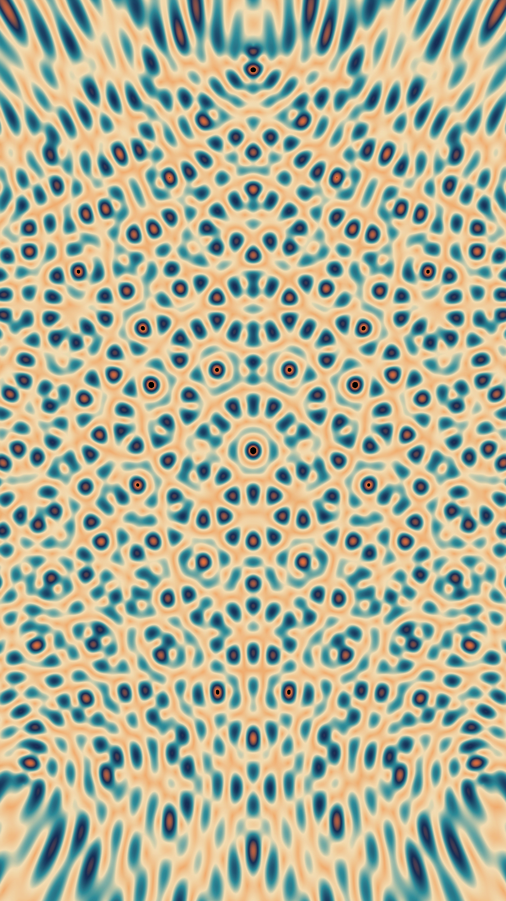
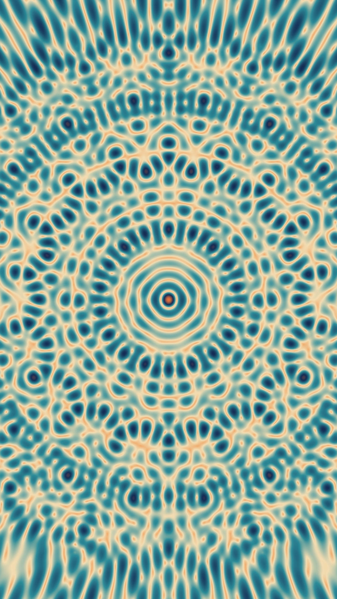
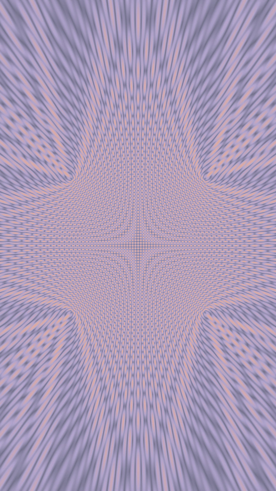

After my circle art phase, I wanted something more _alive_. Enter [**Wavepaper**](https://github.com/DeanIsMe/Wavepaper_Release) a tool for creating dreamy, flowing wave patterns. It’s like if math and the ocean had a baby.

---

## The Wave Experiments

_Smooth and gradient-y_

_Overlapping chaos that somehow works_

_Minimal, calm, clean_

_When waves argue but make art_

---

## Playing With Wavepaper

Wavepaper made things super easy: no code, just sliders and instant visuals. I messed with:

- **Frequency** (tight vs. loose waves)
- **Amplitude** (calm vs. dramatic)
- **Colors** and **layering** for mood

The tiniest tweaks changed everything. Some of my best results came from total accidents 😅

---

## What I Learned

- Simple settings often look the best
- Layering adds depth and movement
- Color totally sets the emotion
- Happy glitches = bonus art

Waves feel connected to generative music, both use math to make something _alive_.

---

## What’s Next

I’m dreaming of:

- **Animated waves**
- **Interactive versions**
- Maybe combining **circles + waves** for a geometric/organic hybrid

---

Working with waves has been oddly meditative , less precision, more flow. It reminds me that coding can be creative, and math can actually _feel_ beautiful.

_(Got wave art or generative experiments? Drop them , I’d love to see what you’re making!)_
