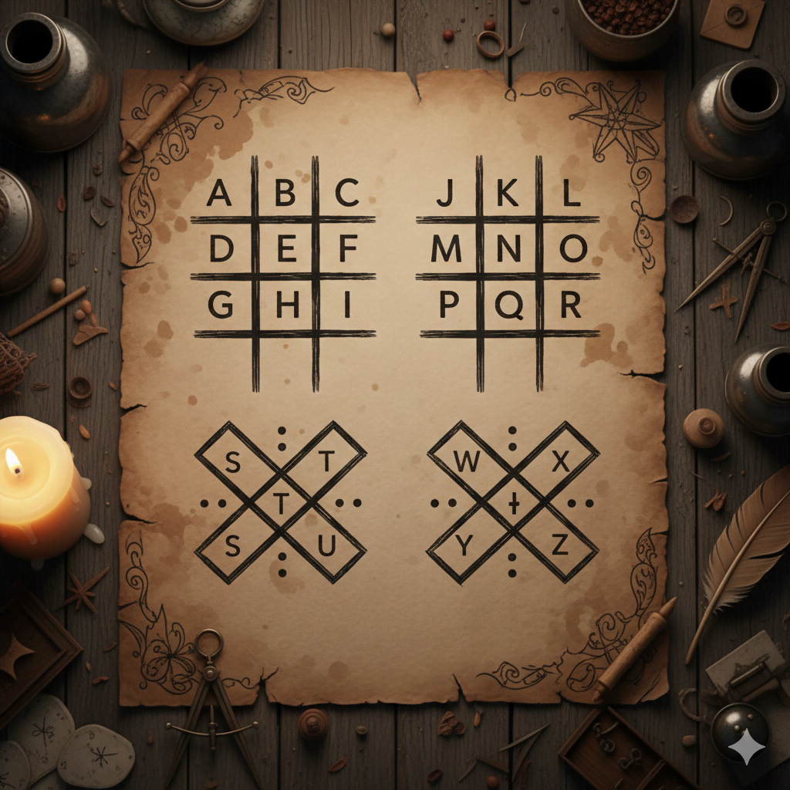

I’ve been using React for years, but somehow never touched **React Native**. No reason , just never had a project idea.
Then one day I saw a random Reddit post about the **Pigpen cipher** (yep, that funky symbol-based code thing 🕵️‍♂️), and suddenly I was like:

> “Wait… what if I turned this into an app so I can send secret messages to friends?”

And that’s how the chaos began.


_The classic Pigpen cipher key , letters turned into secret symbols_

---

## Discovering Expo 🚀

After a quick Google dive, I found [**Expo**](https://expo.io/) , basically React Native’s best friend. It sets up everything for you, zero config.

I ran:

```bash
npm install -g expo-cli
expo init Pigpen-cipher
expo start --web
```

Boom. Instant app with working tabs. One for **encrypting**, one for **decrypting**. I could even preview it in my browser , felt like magic.

---

## The SVG Meltdown 🎨💀

Then I tested it on iOS and… my SVG symbols were _gone_. Poof.
Hours of Googling later, I tried different libraries, converted all my SVGs into React components, and still , nothing.
Turns out, I just **forgot to set width and height** on each SVG. 😭

<iframe allowfullscreen="" class="giphy-embed" frameborder="0" height="300" src="https://giphy.com/embed/6xcqPF9MTwChq" width="300" style="margin: 20px auto; display: block;"></iframe>
_That “ohhhh” moment when the bug finally makes sense 😅_

---

## Success! 🎉

Once I fixed that, everything worked perfectly. You could tap the symbols to **decrypt messages** or type and **encrypt text** back into Pigpen symbols.

Next on the list: let users **save** their secret message as an image to share.

---

## What’s Next

Pushed everything to GitHub (because of course 😎):
👉 [**Pigpen Cipher App on GitHub**](https://github.com/ehsanpo/Pigpen-cipher)

My plan:

- Use `react-native-view-shot` to convert the screen to an image
- Use `react-native-cameraroll` to save it locally

Basically, turning secret code into shareable art.

---

## Key Takeaways 💡

1. **Expo is amazing** , zero setup, instant app.
2. **SVGs need explicit width & height** (learned that the hard way).
3. **Test on real devices**, not just web.
4. Sometimes the “bug” is just… you. 😅

If you’re new to React Native , start with Expo, mess around, break stuff, fix it, and repeat. You’ll learn _so fast_.

---

_Wanna try decoding your own messages? Check out the [GitHub repo](https://github.com/ehsanpo/Pigpen-cipher) and send me your secret notes 🕶️_
