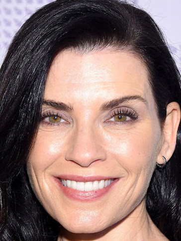
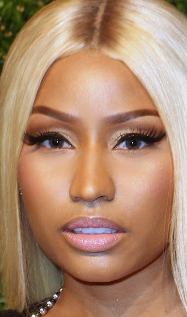

Here’s a **short, casual rewrite** of your AI update post, keeping your playful, self-taught tone **and adding a quick note about ethical use**:

---

# 🤖 AI Update: More Data, More Categories

I’ve trained my AI with a bit more data and added some new categories! Now it can give a little more info:

- Hot
- Ugly
- Fat
- Asian
- Badgirl

Let’s try some new pics! 🙂

---

**Julianna Margulies**
Hot: 0.29 | Ugly: 0.26 | Asian: 0.19 | Fat: 0.18 | Badgirl: 0.07

**Cardi B**
Hot: 0.63 | Fat: 0.17 | Ugly: 0.12 | Badgirl: 0.07 | Asian: 0.003

**I-Hua**
Hot: 0.85 | Asian: 0.13 | Badgirl: 0.003 | Fat: 0.003 | Ugly: 0.001

**Nicki Minaj**
Hot: 0.98 | Fat: 0.007 | Ugly: 0.002 | Badgirl: 0.002 | Asian: 0.0003

---

⚠️ **Quick note on ethics:** This AI is just a silly experiment. Please remember that using AI to judge people’s appearance can be harmful or offensive , it’s fun to play with data, but always respect others and use AI responsibly! ❤️
