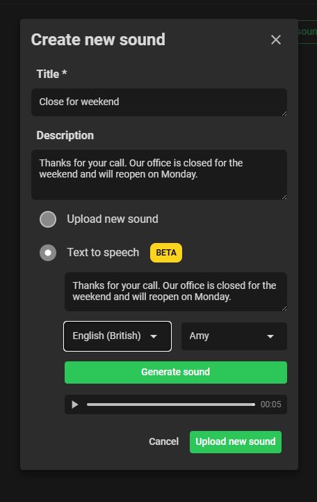

### Project 3: AI Integration & Voice Solutions

I contributed to multiple AI-powered features that enhanced the platform's capabilities and user experience:

#### **Translation Pipeline:**

Our application serves users in multiple languages. While I didn't develop the core translation tool (which replaced our third-party translation service), I was instrumental in:

- Reviewing and testing the translation implementation
- Integrating it into our CI/CD pipeline
- Migrating it from OpenAI to Google Gemini for improved performance and cost efficiency

#### **AI Agent Profile:**

Built a profile page for AI agents with minimal statistics and monitoring capabilities:

- AI agent profile pages displaying key statistics for superuser monitoring
- Call history tracking and visualization
- Real-time status indicators for active AI calls

#### **Text-to-Speech (TTS):**

Implemented a TTS feature using ElevenLabs API that transformed how users create queue messages:

- Instead of uploading audio files for different queue stages, users can now write text and convert it directly to audio
- Multi-language and multi-voice support for diverse user needs
- Seamless in-app audio generation and deployment

