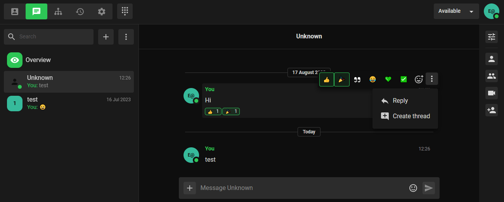

### Project 2: Chat Microservice & Feature Enhancements

Following the TypeScript migration, our team separated the chat functionality into its own microservice, enabling more flexible development and faster feature deployment. I led the development of several key features that significantly enhanced user engagement:

#### **New Chat Features:**

- **Message Reactions:** Users can react to messages with emojis displayed beneath the message, adding quick emotional responses to conversations.
- **Quoted Replies:** Implemented reply functionality allowing users to respond to specific messages, maintaining conversation context.
- **Conversation Threads:** Built a slide-in thread panel enabling users to create separate discussions within the same chat group without cluttering the main conversation.
- **Tenor GIF Integration:** Integrated Tenor API via Google Cloud, allowing users to search and send GIFs directly in chat, making conversations more expressive beyond just emojis.
- **Markdown Support:** Added full markdown rendering support for announcements, code sharing, and styled messages. This was particularly valuable for teams using chat groups as announcement channels, providing better formatting options for important communications.
