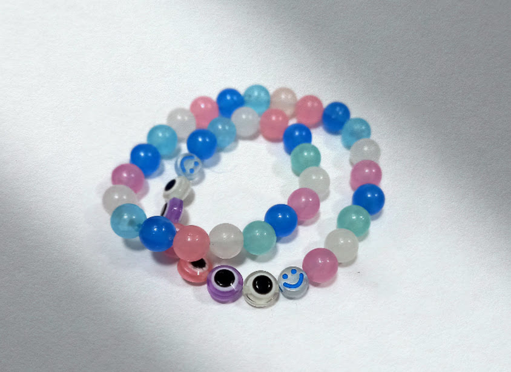

A visual bracelet customization platform that enables users to design personalized bracelets through an interactive builder. Select beads, choose bands, preview designs in real-time, and complete secure purchases all within a streamlined interface.

## Core Features

  

    <h3 class="text-lg font-semibold text-gray-900 dark:text-white mb-3">Real-Time Visual Designer</h3>
    
Interactive preview displays each bead selection instantly on the chosen band. Users see their design evolve as they build, with click-to-remove functionality for quick adjustments. Empty positions appear as dashed placeholders, providing clear visual guidance throughout the design process.

  

  
  

    <h3 class="text-lg font-semibold text-gray-900 dark:text-white mb-3">Dynamic Price Calculation</h3>
    
Order totals update automatically as beads and bands are added or removed. The sticky price calculator remains visible during scrolling, ensuring users always know their current total. Pricing data flows from a simple JSON configuration, eliminating database overhead while maintaining flexibility.

  

  
  

    <h3 class="text-lg font-semibold text-gray-900 dark:text-white mb-3">Structured Product System</h3>
    
Beads and bands are managed through TypeScript interfaces with complete type safety. Each bead tracks its position (0-9), name, color, and price. Bands include material properties, colors, and pricing. This structure enables reliable state management and prevents configuration errors.

  

  
  

    <h3 class="text-lg font-semibold text-gray-900 dark:text-white mb-3">Stripe Payment Integration</h3>
    
Secure checkout powered by Stripe.js ensures payment data never touches the application server. The integration loads asynchronously when needed, optimizing initial page load. Form validation enforces band selection before checkout, preventing incomplete orders.

  

## Precise Control Features

  

    

      

        <svg class="h-6 w-6 text-white" fill="none" stroke="currentColor" viewBox="0 0 24 24">
          <path stroke-linecap="round" stroke-linejoin="round" stroke-width="2" d="M9 12h6m-6 4h6m2 5H7a2 2 0 01-2-2V5a2 2 0 012-2h5.586a1 1 0 01.707.293l5.414 5.414a1 1 0 01.293.707V19a2 2 0 01-2 2z" />
        </svg>
      

      <h4 class="font-semibold text-gray-900 dark:text-white">10-Bead Limit</h4>
      
Enforced maximum capacity prevents overloading while maintaining bracelet structure

    

    

      

        <svg class="h-6 w-6 text-white" fill="none" stroke="currentColor" viewBox="0 0 24 24">
          <path stroke-linecap="round" stroke-linejoin="round" stroke-width="2" d="M7 21a4 4 0 01-4-4V5a2 2 0 012-2h4a2 2 0 012 2v12a4 4 0 01-4 4zm0 0h12a2 2 0 002-2v-4a2 2 0 00-2-2h-2.343M11 7.343l1.657-1.657a2 2 0 012.828 0l2.829 2.829a2 2 0 010 2.828l-8.486 8.485M7 17h.01" />
        </svg>
      

      <h4 class="font-semibold text-gray-900 dark:text-white">6 Band Options</h4>
      
Elastic and cord materials in multiple colors with CSS gradient rendering

    

    

      

        <svg class="h-6 w-6 text-white" fill="none" stroke="currentColor" viewBox="0 0 24 24">
          <path stroke-linecap="round" stroke-linejoin="round" stroke-width="2" d="M15 12a3 3 0 11-6 0 3 3 0 016 0z" /><path stroke-linecap="round" stroke-linejoin="round" stroke-width="2" d="M2.458 12C3.732 7.943 7.523 5 12 5c4.478 0 8.268 2.943 9.542 7-1.274 4.057-5.064 7-9.542 7-4.477 0-8.268-2.943-9.542-7z" />
        </svg>
      

      <h4 class="font-semibold text-gray-900 dark:text-white">Live Preview</h4>
      
Instant visual updates show exact bead placement and color combinations

    

  

## Technical Foundation

This application demonstrates modern web development practices through carefully selected technologies that prioritize performance and developer experience.

  

    

      

        <svg class="h-8 w-8 text-white" fill="none" stroke="currentColor" viewBox="0 0 24 24">
          <path stroke-linecap="round" stroke-linejoin="round" stroke-width="2" d="M10 20l4-16m4 4l4 4-4 4M6 16l-4-4 4-4" />
        </svg>
      

      <h3 class="mb-2 text-lg font-semibold text-slate-900 dark:text-white">React 18 + TypeScript</h3>
      
Modern component architecture with complete type safety prevents runtime errors and improves code maintainability

    

    

      

        <svg class="h-8 w-8 text-white" fill="none" stroke="currentColor" viewBox="0 0 24 24">
          <path stroke-linecap="round" stroke-linejoin="round" stroke-width="2" d="M13 10V3L4 14h7v7l9-11h-7z" />
        </svg>
      

      <h3 class="mb-2 text-lg font-semibold text-slate-900 dark:text-white">Vite Build System</h3>
      
Lightning-fast hot module replacement during development with optimized production builds

    

    

      

        <svg class="h-8 w-8 text-white" fill="none" stroke="currentColor" viewBox="0 0 24 24">
          <path stroke-linecap="round" stroke-linejoin="round" stroke-width="2" d="M7 21a4 4 0 01-4-4V5a2 2 0 012-2h4a2 2 0 012 2v12a4 4 0 01-4 4zm0 0h12a2 2 0 002-2v-4a2 2 0 00-2-2h-2.343M11 7.343l1.657-1.657a2 2 0 012.828 0l2.829 2.829a2 2 0 010 2.828l-8.486 8.485M7 17h.01" />
        </svg>
      

      <h3 class="mb-2 text-lg font-semibold text-slate-900 dark:text-white">TailwindCSS</h3>
      
Utility-first styling with built-in dark mode support and responsive design patterns

    

    

      

        <svg class="h-8 w-8 text-white" fill="none" stroke="currentColor" viewBox="0 0 24 24">
          <path stroke-linecap="round" stroke-linejoin="round" stroke-width="2" d="M12 15v2m-6 4h12a2 2 0 002-2v-6a2 2 0 00-2-2H6a2 2 0 00-2 2v6a2 2 0 002 2zm10-10V7a4 4 0 00-8 0v4h8z" />
        </svg>
      

      <h3 class="mb-2 text-lg font-semibold text-slate-900 dark:text-white">Stripe Integration</h3>
      
Secure payment processing with asynchronous SDK loading for optimal performance

    

    

      

        <svg class="h-8 w-8 text-white" fill="none" stroke="currentColor" viewBox="0 0 24 24">
          <path stroke-linecap="round" stroke-linejoin="round" stroke-width="2" d="M9 12l2 2 4-4m5.618-4.016A11.955 11.955 0 0112 2.944a11.955 11.955 0 01-8.618 3.04A12.02 12.02 0 003 9c0 5.591 3.824 10.29 9 11.622 5.176-1.332 9-6.03 9-11.622 0-1.042-.133-2.052-.382-3.016z" />
        </svg>
      

      <h3 class="mb-2 text-lg font-semibold text-slate-900 dark:text-white">React Router v6</h3>
      
Client-side routing enables smooth navigation between builder, checkout, and confirmation screens

    

    

      

        <svg class="h-8 w-8 text-white" fill="none" stroke="currentColor" viewBox="0 0 24 24">
          <path stroke-linecap="round" stroke-linejoin="round" stroke-width="2" d="M4 5a1 1 0 011-1h14a1 1 0 011 1v2a1 1 0 01-1 1H5a1 1 0 01-1-1V5zM4 13a1 1 0 011-1h6a1 1 0 011 1v6a1 1 0 01-1 1H5a1 1 0 01-1-1v-6zM16 13a1 1 0 011-1h2a1 1 0 011 1v6a1 1 0 01-1 1h-2a1 1 0 01-1-1v-6z" />
        </svg>
      

      <h3 class="mb-2 text-lg font-semibold text-slate-900 dark:text-white">Lucide Icons</h3>
      
Modern, consistent icon library integrated throughout the interface

    

  

  

    <svg class="h-5 w-5 text-white" fill="none" stroke="currentColor" viewBox="0 0 24 24">
      <path stroke-linecap="round" stroke-linejoin="round" stroke-width="2" d="M5 13l4 4L19 7" />
    </svg>
  

  

    Performance Advantage: Vite's HMR provides instant updates during development. Production builds are optimized with tree-shaking and code-splitting, while Lucide icons are excluded from pre-bundling for faster startup.
  

## Who This Is For

  

    

      

        <svg class="h-4 w-4 text-white" fill="none" stroke="currentColor" viewBox="0 0 24 24">
          <path stroke-linecap="round" stroke-linejoin="round" stroke-width="2" d="M16 11V7a4 4 0 00-8 0v4M5 9h14l1 12H4L5 9z" />
        </svg>
      

      <h3 class="text-purple-800 dark:text-purple-200 text-lg font-semibold">Small E-commerce Creators</h3>
    

    
Artisans and small business owners selling customizable products online need a lightweight platform without database complexity or heavy backend infrastructure. This system provides product visualization and secure checkout without operational overhead.

  

  
  

    

      

        <svg class="h-4 w-4 text-white" fill="none" stroke="currentColor" viewBox="0 0 24 24">
          <path stroke-linecap="round" stroke-linejoin="round" stroke-width="2" d="M9.663 17h4.673M12 3v1m6.364 1.636l-.707.707M21 12h-1M4 12H3m3.343-5.657l-.707-.707m2.828 9.9a5 5 0 117.072 0l-.548.547A3.374 3.374 0 0014 18.469V19a2 2 0 11-4 0v-.531c0-.895-.356-1.754-.988-2.386l-.548-.547z" />
        </svg>
      

      <h3 class="text-blue-800 dark:text-blue-200 text-lg font-semibold">Front-end Developers</h3>
    

    
Developers seeking a modern React reference implementation with TypeScript, state management patterns, and payment integration. The codebase demonstrates component composition, routing architecture, and responsive design without unnecessary abstraction.

  

  
  

    

      

        <svg class="h-4 w-4 text-white" fill="none" stroke="currentColor" viewBox="0 0 24 24">
          <path stroke-linecap="round" stroke-linejoin="round" stroke-width="2" d="M12 6.253v13m0-13C10.832 5.477 9.246 5 7.5 5S4.168 5.477 3 6.253v13C4.168 18.477 5.754 18 7.5 18s3.332.477 4.5 1.253m0-13C13.168 5.477 14.754 5 16.5 5c1.747 0 3.332.477 4.5 1.253v13C19.832 18.477 18.247 18 16.5 18c-1.746 0-3.332.477-4.5 1.253" />
        </svg>
      

      <h3 class="text-emerald-800 dark:text-emerald-200 text-lg font-semibold">Technical Learners</h3>
    

    
Students and self-taught developers exploring modern web development patterns benefit from seeing TypeScript interfaces, React hooks, context API usage, and payment integration implemented in a real-world application with practical constraints.

  

  
  

    

      

        <svg class="h-4 w-4 text-white" fill="none" stroke="currentColor" viewBox="0 0 24 24">
          <path stroke-linecap="round" stroke-linejoin="round" stroke-width="2" d="M13 10V3L4 14h7v7l9-11h-7z" />
        </svg>
      

      <h3 class="text-amber-800 dark:text-amber-200 text-lg font-semibold">Fast Prototypers</h3>
    

    
Teams validating product concepts quickly appreciate the minimal infrastructure requirements. No backend server, no database setup, no complex deployment just static hosting and a Stripe account enable a functional e-commerce experience.

  

## Why This Product Exists

This project began with a handmade bracelet. My daughter had started creating bracelets, colorful beaded designs, some with glow-in-the-dark elements and gave me one that I wear daily. Watching her craft these pieces sparked the idea: she could sell these online.

The challenge was finding an appropriate platform. Traditional e-commerce solutions demanded backend infrastructure, databases, and significant technical overhead for what was fundamentally a simple need: let customers choose beads, select a band, see their design, and purchase securely.

Rather than adopt complex systems designed for large-scale inventory management, I built a focused solution. The platform needed to handle visual customization and payment processing without requiring database administration or server maintenance infrastructure that would be excessive for a small creator's needs.

This application proves that modern frontend technologies can replace traditional backend systems for specific use cases. By leveraging TypeScript for type safety, React for state management, and JSON for configuration, the system eliminates operational complexity while maintaining reliability. Each bead and band is a simple data structure. State flows unidirectionally through React components. Stripe handles payment security.

The result is a platform that enables a young creator to run an online business without technical barriers and demonstrates how thoughtful architecture choices can make e-commerce accessible to small-scale artisans.

## Why Choose This Approach

Traditional e-commerce platforms introduce significant overhead for simple customization workflows. Database hosting, server maintenance, and API development create ongoing costs and complexity.

This implementation eliminates those requirements through strategic technology choices:

**No Backend Infrastructure**: Static hosting suffices because product configuration and pricing live in JSON files updated through version control.

**Type Safety Without Complexity**: TypeScript interfaces prevent configuration errors without requiring schema validation servers or database migrations.

**Secure Payments Without Servers**: Stripe.js handles payment processing directly, eliminating PCI compliance concerns and backend payment logic.

**Instant Development Feedback**: Vite's HMR provides sub-second updates during development, accelerating iteration cycles significantly.

**Scalable Through Simplicity**: Adding new beads or bands requires editing JSON and uploading images no database queries, no API endpoints, no deployment coordination.

The architecture demonstrates that modern frontend tools enable complete e-commerce experiences without traditional server infrastructure for specific product categories.

  

    <h3 class="mb-4 text-2xl font-bold">Built with AI Assistance</h3>
    
This project demonstrates practical AI collaboration in software development. The application architecture, component structure, and TypeScript implementation were developed through iterative AI-assisted coding, showcasing how modern development tools accelerate creation while maintaining code quality and best practices.

  

